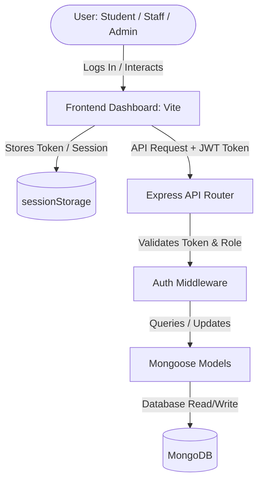

# 🎓 College Placement Management System

A role-based, end-to-end placement management system designed to streamline recruitment drives, training sessions, announcements, and job applications for educational institutions. The application is built using a Full stack consisting of a Node.js/Express API, MongoDB/Mongoose models, and a static frontend served via Vite, complete with automated Cypress E2E test suites.

---

## 🏗️ Architecture & Interaction Flow

The application enforces a Role-Based Access Control (RBAC) mechanism. API request authorization is validated using JSON Web Tokens (JWT) passed in the `Authorization` header.



---

## 📂 Project Directory Structure

```
College-placement-management-System/
├── backend/                  # Express REST API Server
│   ├── api/                  # Serverless function entrypoint for Vercel
│   │   └── index.js          # CORS preflight handler & Express bridge
│   ├── models/               # Mongoose Schema Definitions
│   │   ├── Announcement.js   # News and campus updates
│   │   ├── Application.js    # Student-to-job linkings and statuses
│   │   ├── Job.js            # Placement listings and criteria
│   │   ├── Training.js       # Pre-placement preparation seminars
│   │   └── User.js           # Users (Admins, Staff, and Students)
│   ├── routes/               # API Router modules
│   │   ├── admin.js          # Operations, approval, and management
│   │   ├── auth.js           # Basic/fallback authentication
│   │   ├── staff.js          # Trainings, jobs, and announcements
│   │   └── student.js        # Profile updates, job applications
│   ├── .env                  # Configuration keys & database URI
│   ├── app.js                # Express App initialization and DB connection
│   ├── vercel.json           # Backend serverless deployment configuration
│   └── package.json          # Server dependencies and start scripts
│
└── fontend/                  # Frontend Client Website
    ├── cypress/              # Cypress Automated E2E testing framework
    │   ├── e2e/              # Automated functional testing scripts
    │   ├── fixtures/         # Mock data fixtures
    │   └── support/          # Cypress E2E custom helpers & hooks
    ├── index.html            # Main Landing / Welcome portal
    ├── login.html            # Role-based login terminal (Student/Staff/Admin)
    ├── login.js              # Deprecated/standalone cloud redirection script
    ├── register.html         # Student registration form
    ├── student_dashboard.html# Student profile & application manager
    ├── staff_dashboard.html  # Placement coordinator management console
    ├── admin_dashboard.html  # System administration, roles, and approvals
    ├── vercel.json           # SPA router rewrite guidelines
    ├── cypress.config.js     # Cypress test execution guidelines
    └── package.json          # Client tools, Vite server scripts, Cypress deps
```

---

## 👥 Roles & Capabilities Matrix

The system separates users into three distinct roles to protect sensitive student and job data:

| Feature / Capability | 🔑 System Administrator | 📋 Staff Coordinator | 🎓 Student Candidate |
| :--- | :---: | :---: | :---: |
| **Self-Registration** | No | No | Yes (Awaiting Admin Approval) |
| **Approve Registered Students** | **Yes** | No | No |
| **Manage Staff Accounts** | **Yes** (Create / Remove) | No | No |
| **Manage Job Openings** | **Yes** (Create / Delete) | **Yes** (Create / Delete) | No (Read/Apply Only) |
| **Manage Training Sessions** | **Yes** (Create / Delete) | **Yes** (Create / Delete) | No (Read Only) |
| **Publish Announcements** | **Yes** (Create / Delete) | **Yes** (Create / Delete) | No (Read Only) |
| **Track Applications** | **Yes** (View All) | **Yes** (View All) | **Yes** (Track Own Status) |
| **Update Profiles** | No (System Default) | **Yes** (Name, Email, Password) | **Yes** (Name, Department, Password) |

---

## 🗄️ Database Schemas & Data Models

All models are defined within `backend/models/` using Mongoose schemas:

### 1. User (`User.js`)
Stores all platform users. Role-based fields control student verification status.
*   `name` (String, Required)
*   `email` (String, Required, Unique)
*   `password` (String, Required - stored as bcrypt hash)
*   `role` (String, Enum: `['admin', 'staff', 'student']`, Default: `'student'`)
*   `department` (String)
*   `isApproved` (Boolean, Default: `false` for students, `true` for staff/admins)

### 2. Job (`Job.js`)
Contains placement details and criteria.
*   `title` (String, Required)
*   `company` (String, Required)
*   `description` (String, Required)
*   `eligibility` (String, Required)
*   `lastDate` (Date, Required)

### 3. Training (`Training.js`)
Tracks mock interview series, coding tests, or placement preparation workshops.
*   `title` (String, Required)
*   `description` (String, Required)
*   `date` (Date, Required)
*   `trainer` (String, Required)

### 4. Announcement (`Announcement.js`)
Global notice board announcements visible to staff and students.
*   `title` (String, Required)
*   `content` (String, Required)
*   `date` (Date, Default: `Date.now`)

### 5. Application (`Application.js`)
Binds students to specific jobs they have applied for.
*   `studentId` (ObjectId ref `'User'`, Required)
*   `jobId` (ObjectId ref `'Job'`, Required)
*   `status` (String, Enum: `['applied', 'shortlisted', 'selected', 'rejected']`, Default: `'applied'`)
*   `appliedDate` (Date, Default: `Date.now`)

---

## 📡 API Endpoints Matrix

### Authentication Endpoints
*   `POST /api/student/login` - Student authentication. Generates 2h JWT.
*   `POST /api/staff/login` - Staff coordinator login. Generates 1h JWT.
*   `POST /api/admin/login` - Site administrator login. Generates 1h JWT.
*   `POST /api/auth/register` - General student self-registration endpoint.

### Student Endpoints (`/api/student`)
*   `GET /me` - Fetch logged-in student user profile details.
*   `PUT /me/profile` - Update student profile fields and/or password.
*   `GET /jobs` - List all open placement drives.
*   `POST /jobs/apply` - Submit an application for a specific job drive.
*   `GET /trainings` - View all scheduled training courses.
*   `GET /announcements` - Read notices.
*   `GET /applications` - View list of all applied jobs and interview status.

### Staff Endpoints (`/api/staff`)
*   `GET /me` - Get logged-in coordinator profile.
*   `PUT /me` - Edit coordinator profile parameters.
*   `GET /students` - List all registered students.
*   `POST /students` - Directly insert an approved student.
*   `GET/POST/DELETE /jobs` - Retrieve, create, or delete placement jobs.
*   `GET/POST/DELETE /trainings` - Retrieve, create, or delete workshops.
*   `GET/POST/DELETE /announcements` - Manage board notices.
*   `GET /applications` - View all job applications from all students.

### Admin Endpoints (`/api/admin`)
*   `GET /students` - Retrieve all student records.
*   `PUT /approve/:id` - Set a student's `isApproved` status to `true`.
*   `DELETE /students/:id` - Reject or remove a student.
*   `POST /students` - Create a pre-approved student account.
*   `GET /staff` - List all staff accounts.
*   `POST /staff` - Register a new staff member account.
*   `DELETE /staff/:id` - Remove a staff member.
*   `GET/POST/DELETE /jobs` - Admin control of placement jobs.
*   `GET/POST/DELETE /trainings` - Admin control of training calendars.
*   `GET/POST/DELETE /announcements` - Admin control of announcements.
*   `GET /applications` - Retrieve system-wide application records.

---

## 🛠️ Step-by-Step Installation & Run Guide

### 1. Set Up the Backend REST API
1. Navigate to the backend directory:
   ```bash
   cd backend
   ```
2. Install all npm dependency modules:
   ```bash
   npm install
   ```
3. Create a `.env` configuration file inside the `backend/` directory:
   ```env
   MONGODB_URI=mongodb://127.0.0.1:27017/placementDB
   PORT=5000
   JWT_SECRET=your_custom_secure_secret_key
   ```
4. Run the API in hot-reload development mode:
   ```bash
   npm run dev
   ```
   *For standard execution:*
   ```bash
   npm start
   ```

> [!TIP]
> **Default Admin Account:** On the initial successful connection to MongoDB, the backend automatically registers a default administrator account.
> - **Default Email:** `admin@example.com`
> - **Default Password:** `admin123`

---

### 2. Set Up the Frontend Dev Server
The frontend is constructed using plain HTML pages with Tailwind CSS styling and is compiled via Vite.

1. Navigate to the frontend directory:
   ```bash
   cd fontend
   ```
2. Install dependencies:
   ```bash
   npm install
   ```
3. Launch the Vite development server:
   ```bash
   npm run dev
   ```
4. Open the shown host URL (typically `http://localhost:5173`) in your browser.

---

## 🧪 E2E Cypress Tests Execution

The E2E tests are configured in `fontend/cypress.config.js` and target the local Vite dev server. Make sure both the backend and frontend are running before starting test suites.

1. Navigate to the frontend directory:
   ```bash
   cd fontend
   ```
2. Run tests headlessly in terminal:
   ```bash
   npm run test
   ```
3. Launch Cypress UI to choose and inspect test steps:
   ```bash
   npm run test:open
   ```

### E2E Test Suite Configurations (`fontend/cypress/e2e/`):
*   `homepage_tests.cy.js` - Portal access navigation controls.
*   `login_tests.cy.js` - Valid/invalid credential validation, error warning checking.
*   `registration_tests.cy.js` - Student self-registration and department selection.
*   `student_dashboard_tests.cy.js` - Profile modification, job discovery, and application tracking.
*   `staff_dashboard_tests.cy.js` - Placement jobs listing creation, notices, and training programs creation.
*   `admin_dashboard_tests.cy.js` - Staff creation, pending student approval checklists.

---

